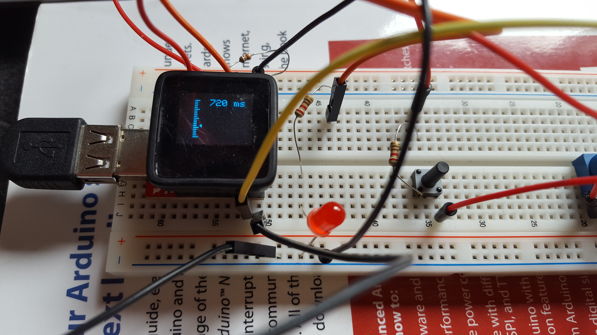
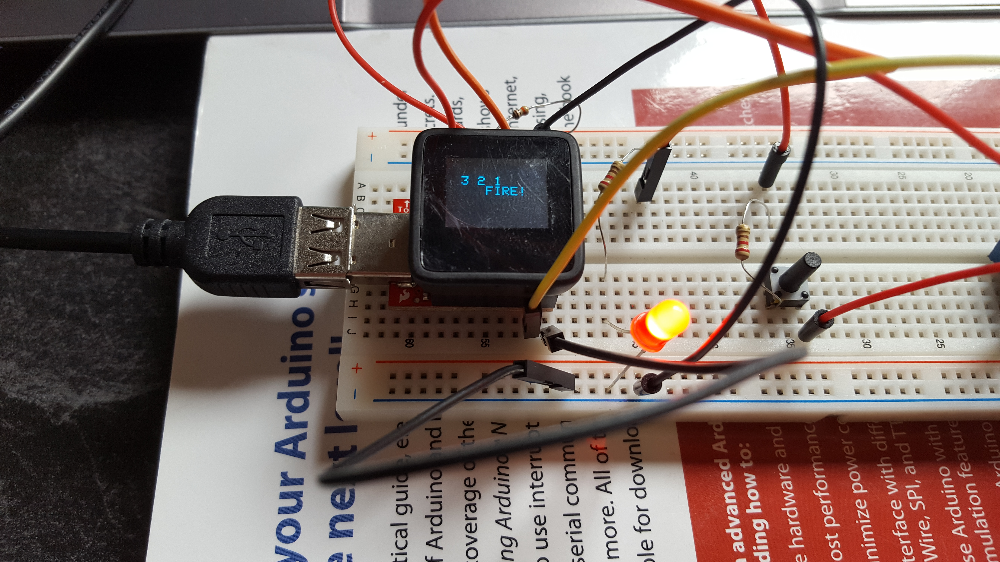

Battery-Tab-Welder
===================
Using Sparkfun's Microview (ATTINY with OLED) to control a spot welder, as shown here:
https://www.youtube.com/watch?v=YWsu8zen13Y

You will need the MicroView library:
https://learn.sparkfun.com/tutorials/sparkfun-inventors-kit-for-microview/programming-the-microview

Hardware
--------

Tested and working on microview from sparkfun and programmer from sparkfun and Arduino IDE 1.6.8.

### Wiring

TODO

### Known Issues

Noise from solenoids sometimes cause uview to hang. Use a momentary "dead man" switch as precaution. Or not. Be sure to get vid of resulting fire.

Prototype
---------

The OLED display shows the desired pulse duration.

When activated, there is a countdown to the pulse.

